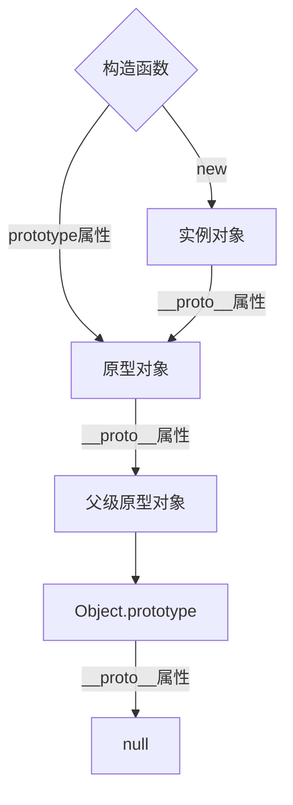

## JS数据类型

#### 1. JS原始数据类型有哪些？引用数据类型有哪些？

###### 原始值：

* Number
* String
* Boolean
* undefined
* null
* symbol
* bigint（大整数，还未正式加入ECMAScript）

###### 引用值：

* 对象Object（普通对象Object，数组对象Array，函数对象Function，正则对象RegExp，日期对象Date，数学函数Math）

#### 2. 下面输出什么结果

```javascript
function test(person)(){
    person.age = 26;
    person = {
        name: 'huanglian',
    	age: 20
    }
    return person
}
const p1 = {
    name: 'hhha',
    age: 22
}
const p2 = test(p1);
console.log(p1); // {age: 26, name: 'hhha'}
console.log(p2); // {age: 20, name: 'huanglian'}
```

#### 3. null是对象吗？

结论：null不是对象

解释：虽然typeof null 会输出一个object，这是JS存在的一个悠久的bug，在js最初的版本中，使用的是32为系统，为了性能考虑使用地位存储变量信息，000开头代表的是对象而null表示全部为零，所以错误判断为object

#### 4. '1'.toSring()为什么可以调用

```javascript
// '1'.toString()在运行时执行了下面几个步骤
let s = new Object('1');
s.toString();
s = null;
```

#### 5. 0.1+0.2为什么不等于0.3

0.1和0.2在转换为二进制后会无限循环，由于标准位数的限制后面多余的位数会被截掉，此时就已经出现了精准的损失。

#### 6. 如何理解BigInt

##### 什么是BigInt

>BigInt是一种新的数据类型，用于当整数值大于Number数据类型支持的范围时。这种数据类型允许我们安全地对大整数执行算数操作，表示高分辨率的时间戳，使用大整数id等等，而不需要使用库

##### 为什么需要BigInt

在js中，所有的数字都以双精度64位浮点格式表示，这会导致js的number无法精确的表示非常大的整数

##### 如果创建并使用BigInt

要创建BigInt，只需要在数字末尾追加n即可

* 2n或者BigInt（2）

    ```javascript
    const x = 2n;
    console.log(typeof x); // bigint
    ```

## JS数据类型——检测篇

#### 1. typeof 是否能正确判断类型

对于原始类型来说，出来null都可以调用typeof显示正确的类型 

```javascript
typeof 1 // number
typeof '1' // string
typeof undefined // undeefind
typeof true // boolean
typeof Symbol() // symbol
```

但是对于引用数据类型，除了函数之外，都会显示’object‘

```javascript
typeof [] // object
typeof {} // object
typeof console.log // function
```


因此采用typeof判断对象数据类型是不合适的，采用instanceof会更好，instanceof的原理是基于原型链查找，只要处在原型链中，判断永远为true

```javascript
const Person = function(){}
const p1 = new Person()
p1 instanceof Person // true

const str1 = 'hello world'
str instanceof String // false

const str2 = new String('hello world')
str instanceof String // true
```

#### 2. instanceof能否判断基本数据类型

能。比如下面这种方式

```javascript
class PrimitiveNumber { // foo instanceof Foo 实际调用的是 Foo[Symbol.hasInstance](foo)
    static [Symbol.hasInstance](x){
        return typeof x === 'number'
    }
}
console.log(111 instanceof PrimitiveNumber) // true
```

#### 3. 手动实现一个instanceof功能

核心：原型链向上查找

```javascript
function myInstanceof(left, right){
    if(typeof left !== 'object' || left === null){
        return false;
    }
    let proto = Object.getPrototypeOf(left);
    while(true){
        if(proto === false){
            return false;
        }
        if(proto === right.prototype){
            return true;
        }
        proto = Object.getPrototypeOf(proto);
    }
}
```

#### 4. Object.is和===的区别

Objec.is()在严格等于上修改了NaN不等于NaN的问题，还有+0等于-0的问题

```javascript
function is(value1, value2){
    if(value1 === value2){
        return value1 !== 0 || value2 !== 0 || 1/x === 1/y;
    }else{
    	return value1 !== value1 && value2 !== value2;
    }
}
```

## js数据类型——转换篇

#### 1. [] ==! []结果是什么，为什么？

解析：

==中，左右两边都需要转换为数字然后去比较

[] 转换为数字为0

![]首先是转化为布尔值，由于[]作为一个引用类型转换为布尔值为true，因此![]为false，进而转换为数字，变为0

0 == 0 ,结果为true

#### 2. js中类型转换有哪几种？

js中，类型转换只有三种

* 转化为数字
* 转化为字符串
* 转换为布尔值

具体规则如下：

|        原始值         | 转换目标 |                           结果                           |
| :-------------------: | :------: | :------------------------------------------------------: |
|        number         |  布尔值  |                  除了0、-0、NaN都为true                  |
|        string         |  布尔值  |                     除了空串都为true                     |
|    undefined、null    |  布尔值  |                          false                           |
|       引用类型        |  布尔值  |                           true                           |
|        number         |  字符串  |                          5=>‘5’                          |
| Boolean、函数、Symbol |  字符串  |                        字符串true                        |
|         数组          |  字符串  |                      [1,2] => '1,2'                      |
|         对象          |  字符串  |                    '[object Object]'                     |
|        string         |   数字   |                   ‘1’ => 1,'a' => NaN                    |
|         数组          |   数字   | 空数组为0，存在一个元素且为<br />数字转数字，其他情况NAN |
|         null          |   数字   |                            0                             |
|  除了数组的引用类型   |   数字   |                           NaN                            |
|                       |   数字   |                           报错                           |

#### 3. == 和 ===有什么区别？

>=== 是严格相等，是指：左右两边不仅值要相等，类型也要相等。
>
>== 不想 === 那样严格，对于一般情况，只要值相等，就返回true，但 ==还涉及一些类型转换，他的转换规则如下
>
>* 两边的类型是否相同，相同的话就比较值大小。
>* 判断是否是null和undefined，是的话就返回true.如果null == undefined // true
>* 判断的类型是否是String和Number，是的话，吧String转换为Number，再进行比较
>* 判断其中一方是否为Boolean，是的话就把Boolean转换为Number，再进行比较
>* 判断其中一方是否为Object，且另一方为String、Number、或者Symbol，会将Object转为字符串，再进行比较

#### 4. 对象转原始类型是根据什么流程运行的

​	对象转原始类型，会调用内置的[toPrimitive]函数，对于该函数而言，其逻辑如下：

 1. 如果是Symbol.toPrimitive()方法，优先调用再返回

 2. 调用valueOf()，如果转为原始类型，则返回

 3. 调用toString()，如果转换为原始类型，则返回

 4. 如果都没有返回原始类型，会报错

    ```javascript
    const obj = {
        value: 3,
        valueOf(){
            return 4
        },
        toString(){
            return '5'
        },
        [Symbol.toPrimitive](){
            return 6
        }
    }
    console.log(obj + 1)； // 7
    ```

    #### 5. 如何让if(a == 1 && a == 2)条件成立

    ```javascript
    const a = {
        value: 0,
        valueOf: function(){
            this.value++;
            return this.value;
        }
    }
    console.log(a == 1 && a == 2); // true
    ```

#### 对于闭包的理解

#### 什么是闭包

>闭包的定义：闭包是指有权访问另外一个函数作用域中的变量的函数

#### 闭包产生的原因

首先要明白作用域链的概念，在ES5中只存在两种作用域——全局作用域和函数作用域，（作用域解释：当访问一个变量时，解释器会首先在当前作用域查找标示符，如果没有找到，就去父作用域找，直到找到该变量的标示符或者不在父作用域中，这就是作用域链），每一个子函数都会拷贝上级的作用域，形成一个作用域的链条

```javascript
const a = 1;
const b = 4;
console.log(a); // 1
function f1(){
    const a = 2;
    console.log(b); // 4
    b = 5;
    console.log(a); // 2
    console.log(b); // 5
    function f2(){
        const a = 3;
        console.log(a); // 3
    	console.log(b); // 5
    }
}
```

#### 闭包有哪些表现形式

1. 返回一个函数
2. 作为函数参数传递

```javascript
for(var i = 1; i <= 5; i ++){
  setTimeout(function timer(){
    console.log(i); // 6
  }, 0)
}
// 解决办法1
for(let i = 1; i <= 5; i ++){
  setTimeout(function timer(){
    console.log(i); // 当前下标
  }, 0)
}
// 解决办法2
for(var i = 1; i <= 5; i ++){
  setTimeout(function timer(i){
    console.log(i); // 当前下标
  }, 0, i)
}
// 解决办法3
for(var i = 1; i <= 5; i ++){
  (function(i){
      setTimeout(function timer(i){
      console.log(i); // 当前下标
  }, 0)
  })(i)
}
```

## 对于原型链的理解

#### 1.原型对象和构造函数有何关系

在JavaScript中，每当定义一个函数数据类型（普通函数，类）时候，都会天生自带一个prototype属性，这个属性指向函数的原型对象。

当这个函数结果new实例后，这个函数就变成了构造函数，返回一个全新的实例对象，这个实例对象有一个__ proto __ 属性，指向这个构造函数的原型对象

#### 2. 能不能描述一下原型链

JavaScript对象通过prototype指向父类对象，直到指向Object对象为止，这样就形成了一下原型指向的链条，即原型链



* 对象的hasOwnProperty()来检查对象自身中是否含有该属性
* 使用in检查对象中是否含有某个属性时，如果对象中没有但是原型链中有，也会返回true