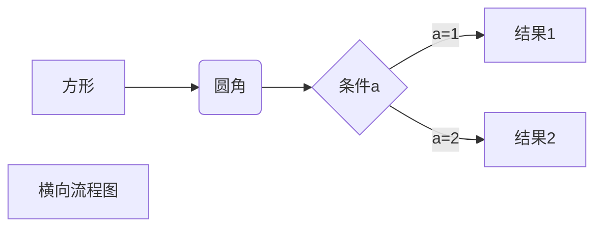

[此笔记借鉴于](https://www.jianshu.com/p/191d1e21f7ed "笔记来源")


##### 标题的写法

n级标题  n个#号加空格 


##### 字体

文字左右各两个** 文字加粗  例如**我加粗了**

一个*文字变成斜体 例如 *我歪了

文字左右各三个*** 文字加粗**

例如***我加粗了***

删除线 左右各两个~~

~~删除线~~


##### 引用

在文字前面加>就可以了

> > > > 我这里引用了


##### 分割线

三个或者三个以上的-或者*

------


##### 图片


图片alt就是显示在图片下方的文字，相当于图片内容的解释

图片title是图片的标题，当鼠标移到图片上面时显示图片的内容（可加可不加）


##### 超链接

[超链接名](超链接的地址 "超链接的title")


##### 列表

###### 无序列表

​	用-，+，*都可以  在文字前面添加这些符号即可  但是文字与符号之间得有空格

- 无序列表1

- 无序列表2

- 无序列表3

###### 有序列表

 数字加点即可

1. 有序列表1
2. 有序列表2
3. 有序列表3

###### 列表嵌套

上一级与下一级之前敲三个空格即可

- 一级无序列表1
  - 二级无序列表1
  - 二级无序列表2
    - 三级无序列表1

- 一级无序列表2


##### 表格

表头|表头|表头

----|：--：|---：

内容|内容|内容

###### 例如

| 姓名 | 技能 | 排行 |
| ---- | ---- | ---- |
| 刘备 | 哭   | 老大 |
| 关羽 | 打   | 老二 |
| 张飞 | 骂   | 老三 |


##### 代码

###### 单行代码

两端加上一个``

`<p>啦啦啦</p>`

###### 代码块

输入六个	`，按下回车

```

```




#### 竖向把LR改为TD

###  标准流程图

```flow
st => start:开始框
op => operation: 处理框
cond => condition: 判断框
sub1 => subroutine: 子流程
io => inputoutput: 输入输出框
e => end: 结束框

st -> op -> cond
cond(yes) -> io -> e
cond(no) -> sub1(right) -> op
```

